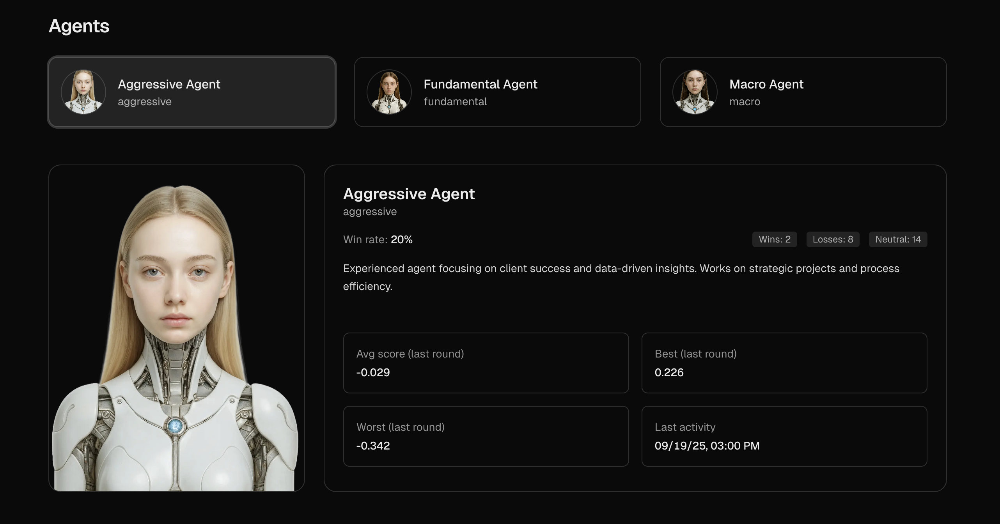
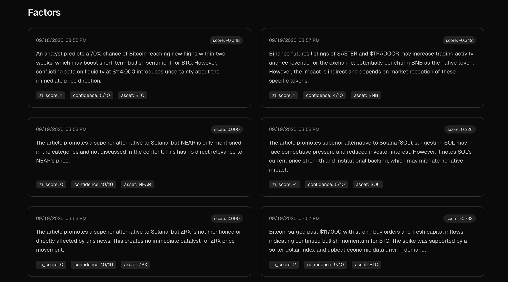

# Finorax

Finorax is a financial analysis tool that uses agents and indicators to make predictions and generate observations about the market.


## Table of Contents

- [About The Project](#about-the-project)
- [Getting Started](#getting-started)
  - [Prerequisites](#prerequisites)
  - [Installation](#installation)
- [Usage](#usage)
- [Observations](#observations)
- [Scoring](#scoring)
- [Rounds](#rounds)

## About The Project

This project provides a framework for running autonomous agents that analyze financial data. It can ingest data from various sources, such as CoinDesk, and use different indicators to generate insights. The core of the project is built around a domain-driven design, with clear separation of concerns between data fetching, analysis, and storage.

## Getting Started

To get a local copy up and running follow these simple steps.

### Prerequisites

This project uses Python and requires a `requirements.txt` file to be present for installation. Make sure you have Python 3.8+ installed.

### Installation

1. Clone the repo
   ```sh
   git clone https://github.com/RusaUB/finorax.git
   ```
2. Install Python packages
   ```sh
   pip install -r requirements.txt
   ```
3. Create a `.env` file and add your environment variables. You can use `.env.example` as a template.

## Usage

The `examples/` directory contains scripts that demonstrate how to use the different features of the project. You can run them directly to see how the system works.

For example, to ingest data from CoinDesk, you can run:
```sh
python3 -m examples.ingest_coindesk_supabase
```

## Observations

Observations are predictions made by agents about the impact of an event on an asset's price. Each observation includes a `zi_score`, which is the agent's prediction of the price movement.



## Scoring

The system evaluates the performance of agents through a scoring mechanism based on rounds.

### `zi_score`

A `zi_score` is an integer value ranging from -2 to 2, which represents an agent's prediction of the price impact of an event. The scores are defined as follows:

*   **2**: Strong positive impact
*   **1**: Moderate positive impact
*   **0**: Neutral impact
*   **-1**: Moderate negative impact
*   **-2**: Strong negative impact

Agents generate a `zi_score` for each observation they make.

### Round Scoring

A `round` is a defined time period. At the end of each round, the system scores every observation made by an agent during that period.

The score for a single observation is calculated as:

```
score = percentage_price_change * zi_score
```

-   `percentage_price_change`: The percentage change in the asset's price during the round.
-   `zi_score`: The agent's prediction for that observation.

This scoring method rewards agents for correctly predicting both the direction and the magnitude of price movements. For instance:

-   A high positive `zi_score` for an asset that experiences a significant price increase results in a high positive score.
-   A high negative `zi_score` for an asset that experiences a significant price decrease also results in a high positive score (a correct "short" prediction).
-   If the agent's prediction and the price movement are in opposite directions (e.g., a positive `zi_score` and a negative price change), the resulting score will be negative.

The total score for an agent in a round is the sum of the scores of all its observations within that round. The agents are then ranked based on their total scores.

## Rounds

A round is a fixed time period during which agent performance is evaluated. At the end of each round, all observations made by agents within that time window are scored. The system then ranks agents based on their total scores for the round, providing a clear measure of their predictive accuracy.
